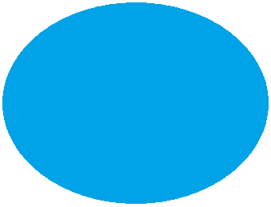

# M5Core2ImageAvatarLite
 ImageAvatarLite for M5Stack Core2 and M5Stack Fire

# 概要

　あらかじめ用意した画像ファイル（BMP)とYAMLファイルの設定を組み合わせてAvatarを作成できるライブラリです。
[](https://www.youtube.com/watch?v=gR_Rzfq-Dh8)
# 開発環境
- VSCode
- PlatformIO

## ArduinoIDEで使用する場合
examplesのフォルダ内にあるsrcフォルダとmain.cppの名前を揃えて変更してください。

### 変更例
src -> M5Core2ImageAvatarLite<br>
main.cpp -> M5Core2ImageAvatarLite.ino

# 必要なライブラリ
<b>詳細各exampleのplatformio.iniを参照してください。</b>

バージョンについては[platformio.ini](platformio.ini)を見てください。
- [M5Unified](https://github.com/m5stack/M5Unified)
- [ArduinoJSON](https://github.com/bblanchon/ArduinoJson)

## サーボを使う場合
- [ServoEasing](https://github.com/arminjo/ServoEasing)
- [ESPServo](https://github.com/madhephaestus/ESP32Servo)

## LEDを使う場合
- [FastLED](https://github.com/FastLED/FastLED)

# 対応機種
 メモリの都合上PSRAMが必要なので下記の3機種を対象にしています。
 4bitBMPを使用し、カラーパレットを使用することにより他の機種でも動きますが手順が複雑なのでCore2及びFireのみとします。

- M5Stack CoreS3
- M5Stack Core2 / Core2 for AWS
- M5Stack Fire

# 使い方
1. SDカードのルートにdataにあるフォルダ(bmp,yamlをコピー
1. jsonフォルダの下記の2ファイルを設定します。
    - M5AvatarLiteSystem.yaml
    - M5AvatarLiteServo.yaml
1. プログラムを書き込むとAvatarが起動します。

# Examples

## Basic
ImageAvatarを表示するサンプルです。

### ボタン操作

- ボタンA
    - クリック<br>アバターの切り替え
- ボタンB
    - クリック<br>ウィンクします。
- ボタンC
    - クリック<br>アバターの表情切り替え

## Mic
- ボタンA
    - クリック<br>アバターの切り替え
- ボタンB
    - クリック<br>ウィンクします。
- ボタンC
    - クリック<br>アバターの表情切り替え


## SDカード上に必要なファイル

dataフォルダ内にあるファイル及びフォルダをSDカードのルートにコピーしてください。
 
 1. - /bmp_slime/<br>BMPファイル(サンプルのbmp_slimeでは全部で11ファイル)
    - /bmp_puipui/<br>
 1. /yaml/<br>
    - M5AvatarLiteSystem.yaml<br>一番最初に読み込まれる設定ファイル
    - M5AvatarLite00slime.yaml<br>slimeの設定ファイル
    - M5AvatarLite01puipui.yaml<br>puipuiの設定ファイル

# yamlファイルとBMPファイルの置き場所について
 main.cppの下記の行を変更するとJSONファイルとBMPファイルの収納場所をSDかSPIFFSか指定できます。SPIFFSに置くと開発するときにVSCodeからUploadできるようになり、SDカードを抜き差しして書き換える手間が省けます。
```
fs::FS yaml_fs = SD; // yamlファイルの収納場所(SPIFFS or SD)
fs::FS bmp_fs  = SD; // BMPファイルの収納場所(SPIFFS or SD)
```
 ## VSCodeからのデータUpload方法（英語）
 [ESP32 with VS Code and PlatformIO: Upload Files to Filesystem (SPIFFS)](https://randomnerdtutorials.com/esp32-vs-code-platformio-spiffs/)

# M5AvatarLiteSystem.yamlの内容
一番最初に読み込まれる設定ファイルです。サンプルではAvatarは2つ定義してあります。（最大20）
```
---
lcd_brightness: 150                        // 液晶の明るさ(0〜255)
avatar_yaml:                               // ImageAvatarのyamlファイルを記述(Max:20) 
- "/yaml/M5AvatarLite00slime.yaml"
- "/yaml/M5AvatarLite01puipui.yaml"
auto_power_off_time: "0"                   // 電源供給が止まると自動的にOFFにする時間(msec) 0だと無効です。
// ---------- 以下はアプリで利用するパラメータです。----------
volume: 200                                // ボリューム(0〜255)
bluetooth_device_name: "ESP32"             // Bluetoothスピーカー用 
bluetooth_reconnect: "false"               // Bluetoothスピーカー用
audio_led_lr: "0"                          // Bluetoothスピーカー用GoBottomを利用する際の光り方。 0:stereo, 1:left_only, 2:right_only
servo_random_mode: "true"                  // Stackchanのサーボ用
use_takao_base : "false";                  // Stack-chan_Takao_Baseを使用して後ろ給電を使用する場合はtrueにしてください。
mic_swing_interval : 0;                    // MicのExampleで設定した間隔(msec)で左右に揺れます。0は無効。
```

 # カスタマイズ方法
 自分で24bitか16bitのBMPファイルを用意すると好きな画像をAvatar化することが可能です。

 ## 用意する画像ファイル
 サンプルの画像ファイルは全て24bitBMPファイルでWindows標準のペイントソフトを利用しています。
 ### 固定パーツ（頭の画像ファイル）
 1. 頭用BMP<br>背景となる画像ファイル320x240もしくは傾けるのであれば少し余裕が必要です。
 
 ### 表情で変わるパーツ(右目と口)
 開いた状態と閉じた状態の<b>２種類×表情の数</b>だけ必要です。(同じパーツを流用も可能)
 1. 開いた目と閉じた「右目」のパーツ（左目は右目を反転させて表示します。）<br>サンプルではnormal,sad,angryの3種類用意してあります。<br>
  
 1. 開いた口と閉じた口のパーツ<br>サンプルでは開いた口normal,sad,angryの3種類と閉じた口は共通パーツとして用意してあります。<br>
  

目と口の透明化したい部分は透明色(M5AvatarLiteConfig.json)で塗りつぶします。サンプルでは緑（0x00FF00）になっています。

## yamlファイルの編集
下記を参考にして、yamlファイルを書き換えてください。
``` 
---
expression:
- "normal"
- "sad"
- "angry"
sprite_info: 
  psram: "true"
  color_depth: "16"
  swap_bytes: "0"
color_info: 
  skin: "0xFF5B00"
  eye_white: "0xFFFFFF"
  transparent: "0x00FF00"
fixed_parts: 
- parts: "body"
  x: "0"
  y: "0"
  w: "320"
  h: "240"
  filename: "/bmp_slime/head.bmp"
mouth: 
-
  normal: 
    x: "160"
    y: "210"
    w: "60"
    h: "60"
    filename: 
      open: "/bmp_slime/mouth_op_normal.bmp"
      close: "/bmp_slime/mouth_cl_normal.bmp"
    minScaleX: "1"
    maxScaleX: "1"
    minScaleY: "0.3"
    maxScaleY: "1"
-
  sad: 
    x: "160"
    y: "200"
    w: "60"
    h: "60"
    filename: 
      open: "/bmp_slime/mouth_op_sad.bmp"
      close: "/bmp_slime/mouth_cl_normal.bmp"
    minScaleX: "1"
    maxScaleX: "1"
    minScaleY: "0.3"
    maxScaleY: "1"
-
  angry: 
    x: "160"
    y: "200"
    w: "60"
    h: "60"
    filename: 
      open: "/bmp_slime/mouth_op_angry.bmp"
      close: "/bmp_slime/mouth_cl_normal.bmp"
    minScaleX: "1"
    maxScaleX: "1"
    minScaleY: "0.3"
    maxScaleY: "1"
eye: 
-
  normal: 
    rx: "130"
    ry: "120"
    lx: "190"
    ly: "120"
    w: "40"
    h: "60"
    filename: 
      open: "/bmp_slime/eye_op_normal.bmp"
      close: "/bmp_slime/eye_cl_normal.bmp"
    minScaleX: "1"
    maxScaleX: "1"
    minScaleY: "0.3"
    maxScaleY: "1"
    invert: "true"
-
  sad: 
    rx: "120"
    ry: "100"
    lx: "200"
    ly: "100"
    w: "40"
    h: "60"
    filename: 
      open: "/bmp_slime/eye_op_sad.bmp"
      close: "/bmp_slime/eye_cl_sad.bmp"
    minScaleX: "1"
    maxScaleX: "1"
    minScaleY: "0.3"
    maxScaleY: "1"
    invert: "true"
-
  angry: 
    rx: "120"
    ry: "100"
    lx: "200"
    ly: "100"
    w: "40"
    h: "60"
    filename: 
      open: "/bmp_slime/eye_op_angry.bmp"
      close: "/bmp_slime/eye_cl_angry.bmp"
    minScaleX: "1"
    maxScaleX: "1"
    minScaleY: "0.3"
    maxScaleY: "1"
    invert: "true"
init_param: 
-
  normal: 
    eye_l_ratio: "0"
    eye_r_ratio: "0"
    mouth_ratio: "0"
    angle: "0"
    breath: "0"
-
  sad: 
    eye_l_ratio: "0"
    eye_r_ratio: "0"
    mouth_ratio: "0"
    angle: "0"
    breath: "0"
-
  angry: 
    eye_l_ratio: "0"
    eye_r_ratio: "0"
    mouth_ratio: "0"
    angle: "0"
    breath: "0"
```

# 参考にしたリポジトリ
- [m5stack-avatar](https://github.com/meganetaaan/m5stack-avatar)
- [M5Stack_WebRadio_Avator](https://github.com/robo8080/M5Stack_WebRadio_Avator)

# 謝辞
このソフトを作成するにあたり、動きや構造の元となった[M5Stack-Avatar](https://github.com/meganetaaan/m5stack-avatar)を作成・公開してくださった[meganetaaan](https://github.com/meganetaaan)氏に感謝いたします。

ImageAvatarを実現するにあたり優れたパフォーマンス、機能を持ったLovyanGFX,M5Unifiedの作者[lovyan03](https://github.com/lovyan03)氏に感謝いたします。

ImageAvatar作成するにあたり、 初期の頃からたくさんのアドバイスを頂き、参考にさせていただいた[M5Stack_WebRadio_Avatar](https://github.com/robo8080/M5Stack_WebRadio_Avator)の作者[robo8080](https://github.com/robo8080)氏に感謝いたします。

色々なアドバイスを頂いた[tobozo](https;//github.com/tobozo)氏に感謝いたします。

# Credit
- [meganetaaan](https://github.com/meganetaaan)
- [lovyan03](https://github.com/lovyan03/LovyanGFX)
- [robo8080](https://github.com/robo8080)
- [tobozo](https://github.com/tobozo)

# LICENSE
[MIT](LICENSE)

# Author
[Takao Akaki](https://github.com/mongonta0716)
